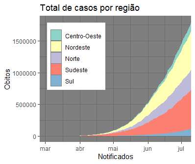

# Descrição do cenario 

    O vírus que causa a COVID-19 é transmitido principalmente por meio de gotículas geradas quando uma pessoa infectada tosse, espirra ou exala. Essas gotículas são muito pesadas para permanecerem no ar e são rapidamente depositadas em pisos ou superfícies.

    Você pode ser infectado ao inalar o vírus se estiver próximo de alguém que tenha COVID-19 ou ao tocar em uma superfície contaminada e, em seguida, passar as mãos nos olhos, no nariz ou na boca

## Material base para análise 

    Link do arquivo .csv para download:

- [covid-br-ms-states.csv](https://raw.githubusercontent.com/marcuswac/covid-br-data/master/covid-br-ms-states.csv)


## Brasil

### Casos no Brasil

```{r, echo=FALSE}
knitr::include_graphics("grafics/02/plot_casos_acumulados_por_brasil.png")
```

### Óbitos no Brasil

```{r, echo=FALSE}
knitr::include_graphics("grafics/02/plot_obitos_acumulados_por_brasil.png")
```

## Estados

### Casos nos estados

```{r, echo=FALSE}

```

### Óbitos nos estados

```{r, echo=FALSE}
knitr::include_graphics("grafics/02/plot_obitos_acumulados_por_regiao.png")
```
